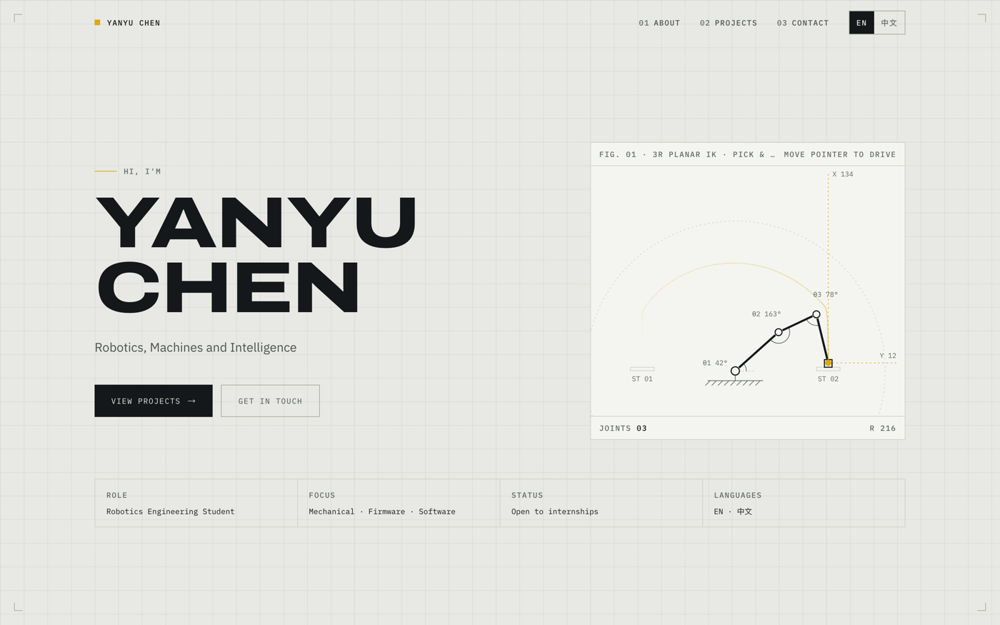
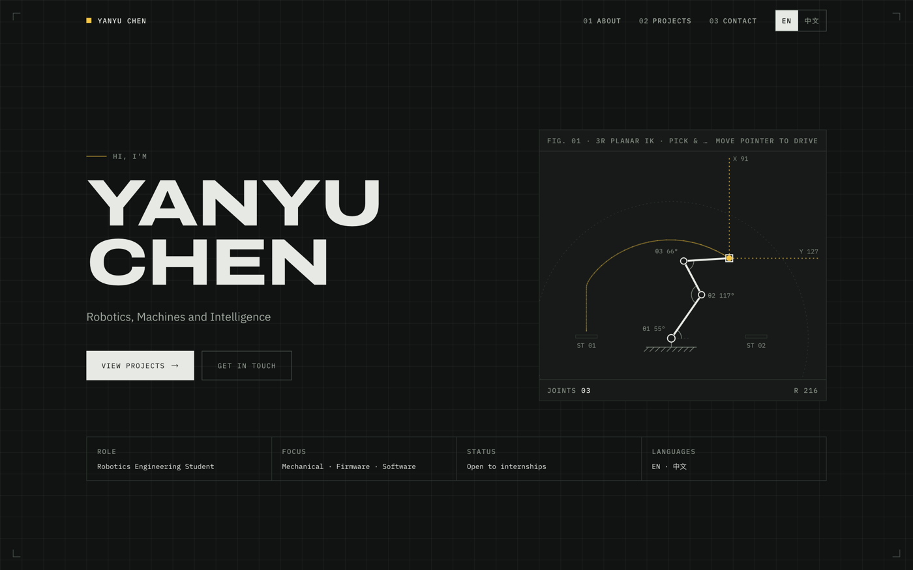

# Yanyu Chen — Engineering Portfolio

A bilingual single-page portfolio for a Robotics Engineering student, built as an
**engineering drawing set**. React, Vite, Tailwind — no UI framework, no runtime dependency
beyond React, ~60 kB gzipped.

<!-- TODO: replace with the deployed URL -->
_Live site: add the deployed URL here._



## The hero is a working IK solver, not an animation

The arm in the corner is real inverse kinematics running every frame. Left alone it runs a
pick-and-place cycle; move the pointer and it tracks it — inside joint limits and a joint
speed limit, and it tells you when it has folded into itself.

`src/lib/ik.js` holds two planar N-link solvers plus the joint limits and rate limiting
that keep the poses mechanical; `src/lib/pickPlace.js` holds the cycle;
`src/components/KinematicSketch.jsx` is purely the drawing and interaction layer. The
solvers are pure and dependency-free, so they can be exercised straight from Node — which
is how every number below was measured.

<details>
<summary><strong>The solver, and why the first one was replaced</strong></summary>

<br>

**`resolveIk`** is ported from the pygame simulation in my Math IA. The chain is solved
backwards from the end effector: each joint is placed where a circle of the current
link's length around the tip meets a circle of the sub-chain's reach around the base. It
runs once, to seed the arm's opening pose.

**`solveFabrik`** drives every frame after that. It alternates a pass from the tip inward
and one from the base outward, each restoring exact link lengths, starting from the pose
the arm is already in.

The switch was about how the motion reads. `resolveIk` is stateless, and its free
parameter scales by how far the target is overall, so every joint reconfigures no matter
how little the target moved — the arm behaves like a tentacle rather than a mechanism.
Measuring each joint's movement against the tip's over a sweep:

| solver | base | | | | tip |
| --- | --- | --- | --- | --- | --- |
| `resolveIk` | 0.00 | 0.55 | 0.56 | 0.82 | 1.00 |
| `solveFabrik` | 0.00 | 0.14 | 0.42 | 0.75 | 1.00 |

FABRIK being incremental also makes it continuous for free, and gives the constraints
somewhere to live.

Three things changed in the port of the IA solver:

- The IA's `find_side` searched for a sub-chain length satisfying the triangle inequality,
  but its predicate ORs the three conditions, so it always accepted the first candidate
  and every sub-chain came back fully taut. A taut sub-chain has to lie radially, which
  collapsed the arm to a straight line with one bend at the last link. `subChainReach`
  scales the target extension by how far the goal actually is — identical to the original
  at full stretch, and distributing the fold across every joint closer in.
- `get_intersections` clamped the centre-line distance `a` to `≥ 0`. It is legitimately
  negative whenever the link circle is smaller than the sub-chain circle, which is the
  common case, and clamping placed the joint off its own circle.
- The reachable region is an annulus, not a disc. Targets inside the inner dead zone are
  pushed back out to it, so a chain with one dominant link stays rigid near the base.

</details>

<details>
<summary><strong>Making it move like a mechanism</strong></summary>

<br>

A chain of line segments will happily fold a link back through the one before it or lay
itself down through its own mount. Those are valid configurations of the maths and of
nothing that has a motor at each joint, so the arm carries a model of one:

- **Joint limits** — ±90° at the shoulder measured from its support, so the first link
  never points below the bench it is bolted to; ±150° at the elbow and ±135° at the wrist.
  Both FABRIK passes respect them. Constraining only the forward pass looks equivalent and
  is not: the backward pass then proposes angles that get clipped rather than followed, the
  outer joints saturate against their stops, and the tip stalls tens of pixels short.
- **A joint speed limit**, 450°/s. Limits alone are not enough. They cut the configuration
  space up, and a redundant arm tracking a target across one of those cuts has a pose
  either side and no continuous path between — so a local solver arrives at the far one in
  a single frame. A real joint cannot, and capping the rate turns each flip into a fast
  swing. What the solver commands and what the arm shows are kept as separate poses: the
  solver always works from its own last answer, so it still converges exactly, and the
  drawn arm chases it.

Measured over a pointer sweep across the whole workspace: 163px of joint movement in one
frame without the speed limit, 20px with it — and 20px is the cap itself, which is to say
the arm is moving rather than jumping. Self-intersecting poses fell from 14% of frames to
8%. The support plane stays a positional preference rather than a limit, expressed in the
backward pass where nothing it produces is drawn.

When left alone the arm runs a pick-and-place cycle rather than wandering: down to the
bench, close, lift, traverse, place, return. Its traverses are swung about the base instead
of ruled straight across — a gantry moves in straight lines, a revolute arm does not, and a
straight traverse asks the tip to hold a constant height across the middle of the
workspace, which is the one place the arm has to fold up tight to reach.

</details>

<details>
<summary><strong>Keeping the motion smooth</strong></summary>

<br>

Running `resolveIk` per frame also twitched badly, for a separate reason. Every step has
two valid solutions — mirror images across the line joining the two circle centres — and
picking "whichever intersection is higher" decides that afresh on every solve. When a
pair sits near level, a sub-pixel change of target flips a whole sub-chain to its mirror
pose: on a smooth sweep, joint jumps of 100–250px, several joints at once. Solving from
the previous pose is what removes this, and FABRIK does it inherently, holding the worst
jump under 2px.

Only the goal is eased, not the pose. FABRIK already moves incrementally from wherever
the arm is, so easing the joints on top of it just fights the solver. The easing uses a
time constant rather than a fixed fraction per frame, so the arm moves at the same rate
on 60Hz and 120Hz displays.

</details>

## The whole page is a drawing set

The metaphor is structural rather than decorative — every device carries real content:

| Drawing convention | What it actually is |
| --- | --- |
| Sheet numbers (01, 02, 03) | Nav order and section order |
| Title block | Role, focus, status, languages |
| Bill of materials | The skills table |
| Drawing list | The projects list |
| Detail view, `Fig. NN` | Project screenshots |
| Registration marks | The sheet corners |
| Dimension callouts | The end effector's live X/Y readout |

Hairline rules and right angles throughout — there is not one `rounded-*` or `shadow-*` in
the codebase.



**Colour** lives entirely in CSS custom properties in `src/index.css` (`--c-paper`,
`--c-ink`, `--c-rule`, `--c-accent`, …), exposed to Tailwind as named colours in
`tailwind.config.js`. The dark theme redefines the same tokens under
`@media (prefers-color-scheme: dark)`, so no component branches on theme and there is no
`dark:` variant anywhere. The amber accent is a *marking* colour — washes, underlines, the
end effector. It never carries text on its own; links are ink with an amber underline, which
keeps contrast legible on both grounds.

**Type** is Archivo (variable width axis, set to 125% via `.font-expanded`) for display,
IBM Plex Sans for body, IBM Plex Mono for every label and data value. All three stacks
append system CJK faces so 中文 falls back deliberately.

**Motion** uses the custom curves `--ease-out` / `--ease-in-out`, animates only `transform`
and `opacity`, gates hover nudges behind `(hover: hover) and (pointer: fine)` so a tap
doesn't strand them, and is fully disabled under `prefers-reduced-motion` — including the
canvas, which drops to a single static frame. `prefers-reduced-transparency` and
`prefers-contrast` have paths too.

## Bilingual, both ways

EN and 中文 are equal citizens rather than a translated afterthought. Every string lives in
`src/translations.json` as `{ "key": { "en": …, "zh": … } }`, language state is React
context, and the toggle switches the whole site and persists. `npm run check` fails if a
string exists in only one language.

## Running it

```bash
npm install
npm run dev

npm run check   # translations, tags, colour tokens — run before calling it done
npm run build   # outputs to dist/
```

`npm run check` catches what the build happily compiles: a string that only exists in
English, a project row whose title would render as `proj_foo_title`, a hardcoded colour
that ignores the dark sheet, or a `bg-paper/50` that silently paints nothing — the Tailwind
colours resolve to `var(...)`, so opacity modifiers on them do nothing at all.

Deployed on Vercel from `dist/`, with a custom domain via Cloudflare in DNS-only mode
(grey cloud).

## Working on this repo

| | |
| --- | --- |
| [AGENTS.md](AGENTS.md) | Coding conventions — read first, human or AI |
| [docs/PRODUCT.md](docs/PRODUCT.md) | Audience, invariants, voice |
| [docs/CONTENT.md](docs/CONTENT.md) | Adding projects, tags, and images; repo layout |
| [docs/JOURNAL.md](docs/JOURNAL.md) | Running work log, newest first |
